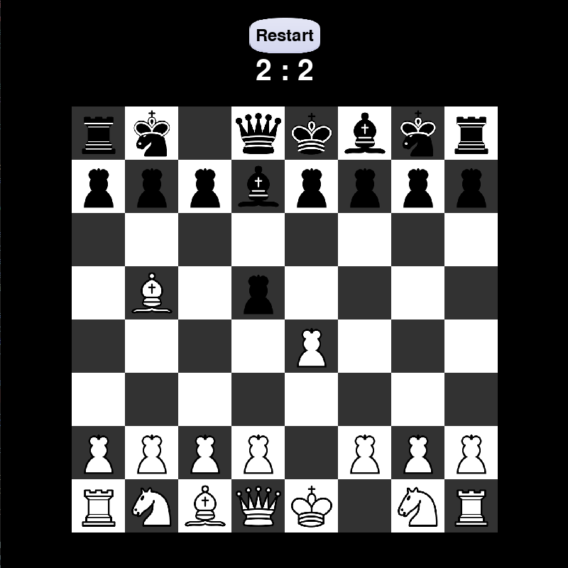

# Шахматы на Python

Это проект игры **Шахматы**, написанной на языке Python с использованием библиотеки `pygame` версии **2.6.1**. Игра реализует все основные правила шахмат, включая движение фигур, возможность взятия на проходе, рокировку и определение шаха и мата.

Проект вёлся мной для изучения языка Python. Обманчево простая игра - отличная тренировка для ума.



## Особенности

- Полная реализация всех шахматных фигур:
  - Пешка
  - Конь
  - Слон
  - Ладья
  - Ферзь
  - Король
- Присутствует нотация Форсайта (Forsyth–Edwards Notation, FEN) для реализации клиент-серверного взаимодействия передачи информации о состоянии партии, либо для воссоздания незавершенных партий в других сеансах
- Проверка правил шахмат:
  - Ходы ограничены правилами движений фигур.
  - Возможность шаха, мата и пата.
- Поддержка рокировки и взятия на проходе.
- Графический интерфейс на основе `pygame`.
- Возможность перезапуска партии.
- Обработка игровых событий: перемещение фигур, определение победителя или ничьи.

## Установка
1. Клонируйте репозиторий:
```bash
   git clone https://github.com/username/chess-game.git
```

2. Инициализируйте виртуальную среду
```bash
  python -m venv venv
```

3. Активируйте виртуальную среду
```bash
  venv\Scripts\activate
```


### Установка зависимостей
Для запуска игры необходимо наличие Python версии **3.8+** и установленной библиотеки `pygame`.
``` bash
  pip install -r requirements.txt
```
### Запуск

Запустите файл main.py:

```bash
  python main.py
```

После запуска откроется окно с графической доской, готовой к игре.

### Структура проекта
`main.py`: Основной файл для запуска игры.

`lib/`: Логика игры и управление доской.

`game/`: Каталог с необходимыми файлами управления библиотекой, ресурсами (спрайты фигур, изображение кнопок) и pygame.

### Зависимости
```
Python 3.8+
pygame 2.6.1
```
